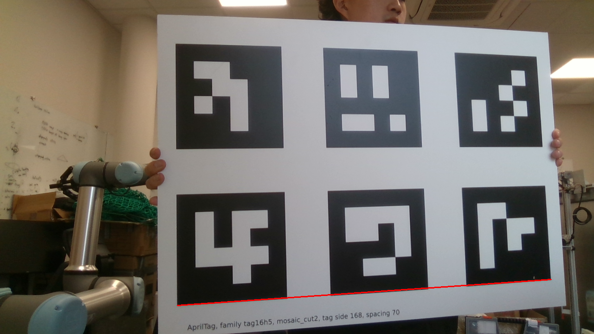
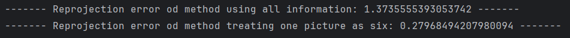
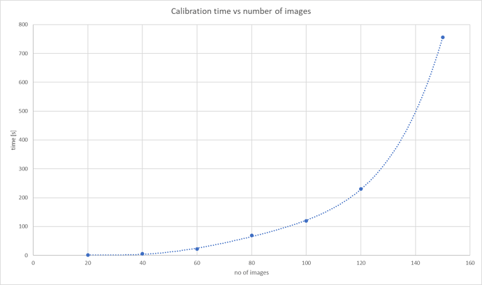
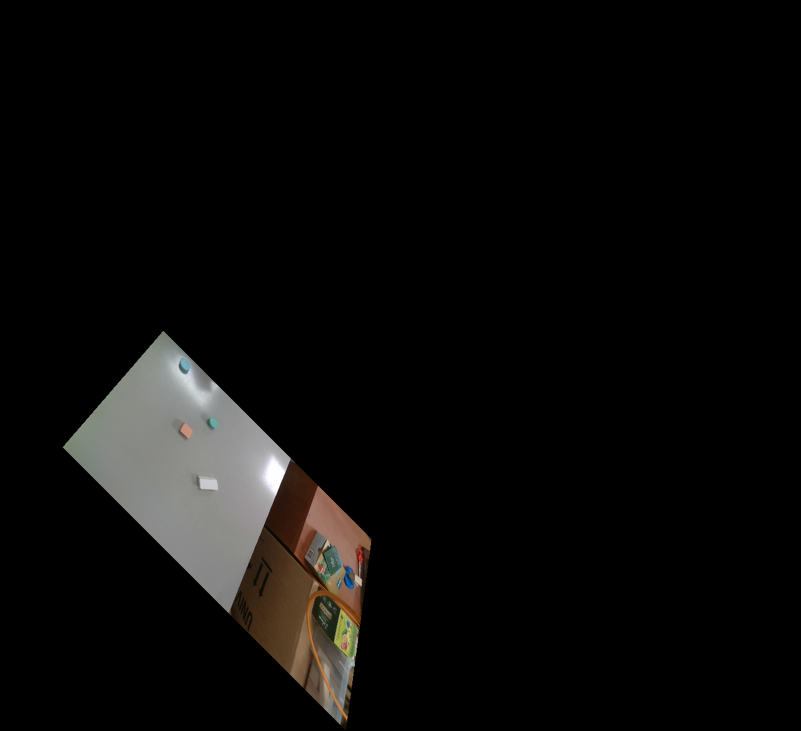
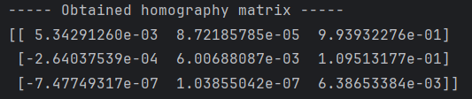
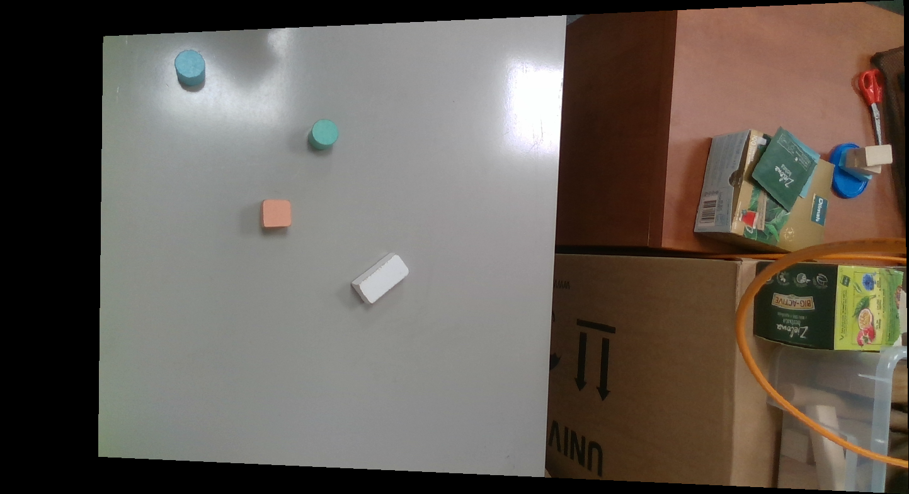
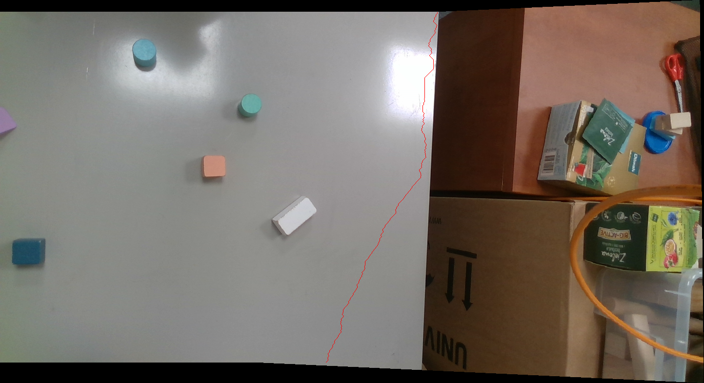
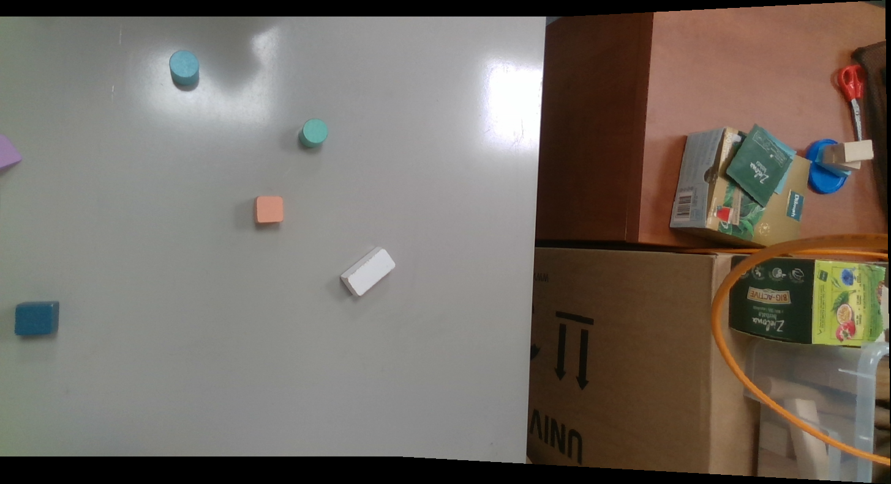
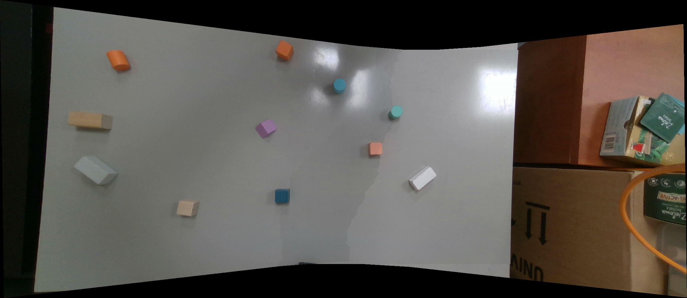

# Image stitcher

---

## Prerequsities

Following project is first homework for Robot Control course at MIMUW faculty (2024/25). Below there is presented a
description of how to run each task followed by discussion of results. Let's start with technical information:

- I used `Python 3.11`.
- All dependencies are listed in `requirements.txt` file.

Each task starts after `### Task {i} ###` comment. To run task `i`, you have to uncomment code
between `# --- execution ---` marks between `### Task {i} ###` and `### Task {i+1} ###` and possibly some other
functions if mentioned.

## Task 1

---

### How to run?

- Uncomment the code between `# --- execution ---` marks. You can select the code with your mouse and
  press `Ctrl + /` if you're using PyCharm or VSC.
- After that, a piece of code between `# ---- Long computations ----` marks will still be commented. Leave it as it is,
  because these computations take a lot of time and results are described below.
- Run the script
- Comment code between `# --- execution ---`

### Discussion of results

After running the script, we display following images:

#### Distorted image

#### Image undistorted using all information (Method 1)

#### Image undistorted treating one image as six (Method 2) - optional

As we can see in the pictures, Method 1 gives better results than Method 2. Contrary to distorted image and Method 2,
straight lines appear straight (highlighted by the red line).

As a result, I used matrix obtained from method 1 to undistort all images.

The script displays also information about reprojection loss:

The loss is higher for Method 1, but it's due to bigger number of images in Method 2.

What's woth noticing is the computation time. `cv2.calibrateCamera` is not linear and takes much more time to compute (
therefore I recommend to keep this method commented). As I found on the internet, this is more or less the plot of time
complexity:

## Task 2

---

### How to run it?

- Uncomment code between `# --- execution ---` marks
- Run the script
- Comment code between `# --- execution ---` marks

### Discussion of results

After running the script, following image is displayed:

As one can see, the transformation is performed and no pixels are lost (I used backward homography with nearest
neighbor). In this case, the centre of coordinate system (point (0,0)) is in the top left corner.

## Task 3

---

### How to run it?

- Uncomment code between `# --- execution ---` marks
- Run the script
- Comment code between `# --- execution ---` marks

### Discussion of results

This time, the script does not display any visible data. It performs a test that:

- picks a random homography (and normalizes it),
- computes the matching pairs based on this homography (random number of points - from 4 to 10 for each
  iteration),
- checks that the implemented method recovers it.

The process repeats 20 times. The homography matrix is recovered with precision up to 1e-14. The test is performed by
following line

`assert np.all(np.isclose(homography_matrix, M, rtol=1e-14, atol=1e-14))`

where `homography_matrix` is input and `M` is a recovered matrix.

## Task 4

---

### How to run it?

- Uncomment code between `# --- execution ---` marks
- Run the script
- Comment code between `# --- execution ---` marks

# Discussion of results

After choosing corresponding points (between picture 1 and 2), we obtain a following matrix

A transformed image looks good as well

## Task 5

---

### How to run it

- Uncomment code between `# --- execution ---` marks
- Make cure you have included the `matches` folder
- If you want to highlight the cutting line, uncomment a fragment inside `stitch` function (~line 348)
- Run the script
- Comment code between `# --- execution ---` marks

### Discussion of results

As a result we obtain following image:

The cutting line is hardly visible, so the algorithm served its purpose.
After uncommenting a fragment in `stitch` function (~line 348), one can see where the line was drawn.

## Task 6

---

### How to run it?

- Uncomment code between `# --- execution ---` marks
- Run the script
- Comment code between `# --- execution ---` marks

### Discussion of results

Once again, the results are pretty good. Personally, I can't spot a difference between images generated in task 5 and 6.

## Task 7

---

### How to run it?

- Uncomment code between `# --- execution ---` marks
- Run the script
- Comment code between `# --- execution ---` marks

### Discussion of results

The implemented algorithm worked correctly. Below I present a panorama that consists of five images.

